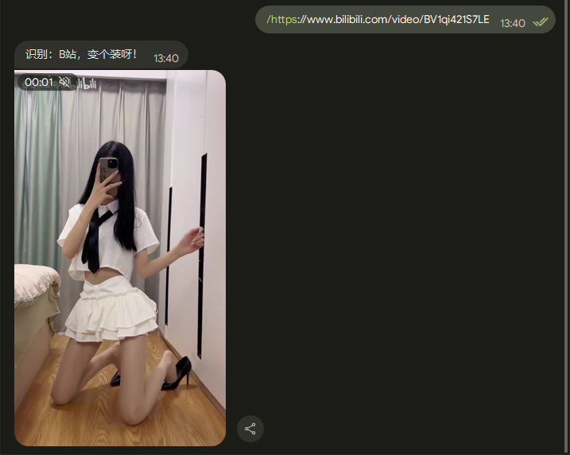

<p align="center">
  <a href="https://gitee.com/kyrzy0416/rconsole-plugin">
    
  </a>
</p>


<div align="center">
    <h1>Spring-Telegram-Bot</h1>
    基于 python-telegram-bot 的机器人框架，像写 Spring 一样快速实现 TG Bot 功能！
</div>

---

✨ 特点：
- 📦 开箱即用
- 🍃 Rest 风格写法
- 🔜 快速迁移 nonebot2 插件
- 🤗 新手友好型

## 快速开始

安装依赖
```python
pip install -r requirement.txt
```

填写`.env`的`TOKEN`、`PROXY`：
```properties
TOKEN=''
PROXY=''
```

启动
```python
python3 main.py
```

## 插件编写

1. 在`plugins`下创建插件文件夹
```
├─plugins
│  ├─resolver
```
2. 创建一个`__init__.py`
3. 直接命令编写
```python
@command_handler('start')
async def start(e: Event):
    await e.send_message(
        f"{e.user_name} 你好，我是 @RrOrangeAndFriends 最好的朋友，可以帮助你下载哔哩哔哩视频、YouTube视频、小红书图片和视频等")
```

4. 正则命令编写
```python
@regex_handler('bilibili.com')
async def bilibili(e: Event):
    pass
```

## 效果展示

由我写的 [nonebot2 插件](https://github.com/zhiyu1998/nonebot-plugin-resolver) 快速迁移过来：
